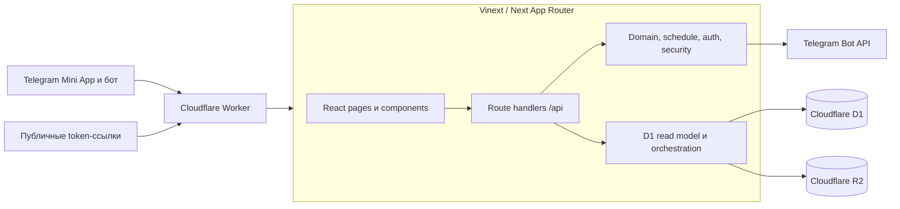

# Asar

> Asar помогает постоянному кругу людей собрать конкретное общее дело, заранее увидеть риск срыва, зафиксировать фактический результат и сохранить добровольно указанные возможности участников для следующих дел.

Asar — единое full-stack приложение для Telegram Mini App и защищённых публичных ссылок. В одном репозитории находятся интерфейс, HTTP API, доменные правила, база данных, Telegram-интеграция и Cloudflare Worker.

Этот README — единая точка входа во весь проект: продуктовая модель, текущий статус MVP, пользовательские сценарии, архитектура, данные, безопасность, локальный запуск и выпуск.

## Продуктовая модель

```mermaid
flowchart LR
  CIRCLE["Круг людей"] --> ASAR["Асар"]
  ASAR --> NEEDS["Потребности"]
  NEEDS --> INVITES["Приглашения"]
  INVITES --> COMMITMENTS["Обязательства"]
  COMMITMENTS --> READINESS["Готовность"]
  READINESS --> CHECK["Контрольная перекличка"]
  CHECK --> DAY["Проведение"]
  DAY --> HISTORY["Результат и история"]
  HISTORY --> OFFERS["Добровольные возможности"]
  OFFERS --> NEXT["Следующий асар"]
```



Продукт хранит три разных вида информации:

1. Что нужно сделать сейчас и какие люди или ресурсы для этого необходимы.
2. Кто подтвердил участие, кто прибыл или не пришёл, и был ли общий результат полным или частичным.
3. С чем человек сам разрешил связывать свой профиль для будущих общих дел.

Asar не превращает помощь в долг, рейтинг, баллы или автоматическую обязанность. Решение об отправке приглашения и переклички всегда принимает человек.

## Текущий статус MVP

README описывает фактически существующий код, а не только исходное продуктовое видение.

| Область | Статус | Что доступно сейчас |
| --- | --- | --- |
| Telegram Mini App | Работает | Проверка Telegram-пользователя, серверная сессия, бот, webhook и deep links. |
| Круги | Частично | Создание круга с фото, страница участников, активные асары, история и архив. Нет интерфейса добавления и удаления постоянных участников. |
| Создание асара | Работает | Четырёхшаговый мастер, категории, расписание, локации, согласие получателя и критические потребности. |
| Приглашения | Работают | Общее приглашение и ссылка на одну потребность, Telegram-ссылка и публичная карточка. |
| Отклик и управление участием | Работают | Защищённое занятие места, подтверждение, отмена, комментарий, количество ресурса и личная manage-ссылка. |
| Готовность | Работает | `NOT_READY`, `PROVISIONAL`, `READY`, критические роли и взвешенный процент. |
| Контрольная перекличка | Работает | Ручной запуск за 48 часов, ответы по ролям, Telegram или ручная доставка, одно напоминание. |
| День асара и завершение | Базовый цикл работает | Отметки `ATTENDED`/`NO_SHOW`, полный или частичный результат и итоговая заметка. |
| История и профиль | Частично | История организованных и посещённых дел, собственный набор возможностей и `RECEIVE_ONLY`. Нет отдельного описания фактического вклада по каждой роли. |
| Персональные приглашения | Частично | Ручное приглашение существующего участника круга в активный асар через бота и дата последней отправки. |
| Умные рекомендации | Следующий этап | Сопоставление роли с возможностями, объяснимый score и fairness пока не реализованы. |
| Автоматический post-asar follow-up | Следующий этап | Инициатор может обновить собственный профиль при завершении; отдельного follow-up для каждого участника пока нет. |
| Тестирование | Частично | Production build и 29 unit-тестов. Полного API integration/E2E набора пока нет. |

## Роли и доступ

### Инициатор

Инициатор входит через Telegram, состоит в постоянном круге и управляет созданным им асаром. Он может:

- создать круг и асар;
- определить критические и дополнительные потребности;
- опубликовать общее или точечное приглашение;
- видеть контакты откликнувшихся людей;
- следить за готовностью;
- вручную запускать контрольную перекличку;
- отмечать прибытие и неявку;
- завершать или отменять асар;
- просматривать историю и отправлять персональные Telegram-приглашения существующим участникам круга.

### Участник круга

Постоянный участник видит доступные ему круги, свой профиль, историю завершённых дел и добровольно указанные возможности. Изменять возможности человека может только он сам.

### Гость по ссылке

Гость может открыть безопасную карточку асара, выбрать свободную роль и оставить контакт без создания аккаунта. После отклика он получает личную ссылку управления участием.

Отклик на асар не делает гостя постоянным участником круга. Членство в круге и обязательство в одном асаре — разные сущности.

## Полный пользовательский сценарий

### Сценарий инициатора

1. Открыть Mini App через Telegram и создать постоянный круг.
2. Создать асар внутри круга.
3. Указать задачу, дату или период времени, безопасную публичную локацию и точный адрес.
4. Подтвердить согласие получателя помощи.
5. Добавить людей, специалистов, транспорт, инструменты или материалы и отметить критические позиции.
6. Опубликовать асар и отправить общее приглашение либо ссылку на конкретную нехватку.
7. Следить за откликами, подтверждениями и состоянием готовности.
8. При необходимости за 48 часов вручную запустить перекличку.
9. Начать асар, отметить фактическое прибытие участников и неявки.
10. Зафиксировать полный или частичный результат и итоговую заметку.
11. Увидеть завершённое дело в истории круга и профиля.

### Сценарий участника

1. Открыть Telegram deep link или браузерную ссылку приглашения.
2. Увидеть только публичную информацию: задачу, время, район, инициатора и свободные роли.
3. Выбрать один конкретный вклад и указать контакт; для ресурсов — количество.
4. Telegram-пользователь подтверждается сразу, внешний гость подтверждает участие по личной ссылке.
5. После подтверждения увидеть точный адрес и при необходимости отменить участие: при точном времени — до старта, при приблизительном — до конца выбранного периода.
6. Если инициатор запустил перекличку, отдельно ответить по каждой занятой роли.
7. Авторизованный Telegram-пользователь или явный участник круга после завершения увидит асар в своей истории, если участие отмечено как `ATTENDED`. Внешний гость по телефонному контакту собственного профиля в текущем MVP не получает.

## Основные модули продукта

### 1. Telegram и панель инициатора

Корневой маршрут `/` загружает официальный `telegram-web-app.js`, создаёт защищённую серверную сессию и открывает панель инициатора. Панель показывает активные, готовые и завершённые асары, процент готовности и требующий реакции риск.

Mini App распознаёт start-параметры:

- `join_<token>` — приглашение в асар;
- `commit_<token>` — управление участием;
- `reconfirm_<token>` — контрольная перекличка.

Webhook бота отдельно обрабатывает `/start`, `join_` и `reconfirm_`, создаёт подписанный launch token и возвращает кнопку открытия Mini App.

В production обычный organizer-интерфейс открывается через Telegram. Без Telegram доступны прямые браузерные маршруты `/join` и `/commitment`; reconfirmation-ссылка работает без Telegram только для запроса, не привязанного к `participant_key`. Маршрут `/invite` является Telegram-first и перенаправляет к боту.

### 2. Постоянные круги

Круг связывает людей, текущие асары и историю общих дел.

Сейчас можно:

- создать круг с названием и описанием;
- загрузить JPEG, PNG или WebP-фото размером до 3 МБ;
- увидеть роль пользователя в круге;
- открыть профили существующих участников;
- разделить текущие, завершённые и отменённые асары;
- начать новый асар сразу в контексте выбранного круга.

Фото хранится в R2. В новую группу автоматически добавляется её владелец. Полный onboarding, добавление и удаление других постоянных участников остаются следующим этапом.

### 3. Конструктор асара

Мастер создания состоит из четырёх шагов:

1. Выбор или создание круга.
2. Описание дела и расписания.
3. Добавление потребностей.
4. Итоговая проверка и создание черновика.

Поддерживаются категории:

- переезд;
- ремонт;
- уборка;
- подготовка;
- доставка;
- другое.

Расписание может быть точным или приблизительным: утро, день, вечер либо гибкое время. Инициатор отдельно указывает публичный район и точный адрес. Создание требует будущей даты, согласия получателя помощи и хотя бы одной критической потребности.

### 4. Потребности и приглашения

Потребность содержит тип, понятное название, описание, требуемое количество и признак критичности. Реализованы пять типов:

- помощники;
- специалист;
- транспорт;
- инструмент;
- материал.

После публикации инициатор создаёт:

- `FULL_ASAR` — приглашение с выбором любой свободной роли;
- `SINGLE_REQUIREMENT` — ссылку только на конкретную нехватку.

Bearer-токен создаётся на 14 дней. Новый отклик принимается только пока эффективный lifecycle остаётся `PUBLISHED` или `IN_PROGRESS`; завершённая, отменённая или вычисляемая `EXPIRED` карточка доступна только как история. InviteComposer готовит текст, карточку-изображение и системный Web Share для Telegram-first маршрута `/invite`; прямой `/join` возвращается API, но пока не вынесен в отдельную кнопку интерфейса.

### 5. Обязательства и личная ссылка

Отклик создаёт `commitment` на одну потребность:

- Telegram-пользователь получает статус `CONFIRMED` сразу после проверенной идентификации;
- внешний гость получает `CLAIMED` и подтверждает участие по `/commitment/:token`;
- человек или контакт не может дважды занять одну и ту же потребность;
- люди и специалисты занимают по одному месту, ресурс может содержать несколько единиц;
- условный SQL-запрос не позволяет двум параллельным откликам переполнить последнее место;
- точный адрес не входит в публичную карточку и открывается после подтверждения;
- подтверждённое участие можно отменить до окончания временного окна асара.

На странице управления Telegram-участник до запуска переклички может отдельно разрешить одно сообщение перед началом. По умолчанию разрешение выключено.

### 6. Готовность

Жизненный статус асара и его операционная готовность рассчитываются отдельно.

| Готовность | Условие |
| --- | --- |
| `NOT_READY` | Хотя бы одна критическая потребность занята не полностью. |
| `PROVISIONAL` | Критические места заняты, но часть обязательств ещё не подтверждена или требует свежего ответа. |
| `READY` | Все критические количества имеют актуальное подтверждение. |

`claimedQuantity` показывает занятое количество, `confirmedQuantity` — подтверждённое. Некритическая нехватка влияет на процент, но не понижает `READY`. При расчёте процента критическая потребность имеет вес 3, дополнительная — вес 1.

### 7. Контрольная перекличка

Перекличка — один этап существующего асара, а не отдельный продукт.

- Инициатор запускает её вручную внутри 48-часового окна.
- Один человек получает один запрос, даже если занял несколько ролей.
- По каждой роли хранится `PENDING`, `CONFIRMED` или `CANCELLED`.
- Ожидание сохраняет место занятым, но делает подтверждение несвежим.
- Один Telegram-запрос отправляется человеку, если opt-in включён хотя бы у одного из его сгруппированных commitments; запрос всё равно содержит все его роли. Для остальных запрос получает `MANUAL_REQUIRED`, после чего инициатор отдельно выпускает ротируемую ручную ссылку.
- Разрешено одно повторное напоминание не раньше чем через 6 часов.
- Отказ освобождает количество и сразу пересчитывает готовность.
- Неответивший человек не отменяется автоматически.
- Смена расписания закрывает раунд; старт, завершение и отмена асара также закрывают его.
- Пока раунд активен, видимая панель обновляется каждые 30 секунд и после возврата в приложение.

### 8. День асара и завершение

До назначенного времени асар можно начать раньше только при `READY`. После наступления времени инициатор может начать проведение. Отдельный чек-лист участников доступен на `/app/asars/:id/day`; автоматического перехода или видимой ссылки на него из основной карточки пока нет.

Для каждого commitment фиксируется:

- `ATTENDED` — участник прибыл;
- `NO_SHOW` — участник не пришёл.

При завершении инициатор выбирает `FULL` или `PARTIAL` и оставляет итоговую заметку. Завершённое дело становится историей; отменённое хранится отдельно в архиве.

Текущая версия не хранит отдельный текст фактического вклада по каждой роли и не поддерживает статус «опаздывает».

### 9. История, профиль и будущие приглашения

Профиль человека един для всех его кругов и показывает:

- постоянные круги;
- организованные или фактически посещённые завершённые асары;
- добровольно выбранные варианты помощи;
- контекст конкретного круга.

Доступны варианты: совет, знакомство с человеком, местная информация, еда или чай, помещение, обзвон, координация, инструмент и передача опыта. `RECEIVE_ONLY` означает, что человеку сейчас самому нужна поддержка или он не принимает новые просьбы. В текущем MVP это профильный маркер: endpoint персонального приглашения пока не блокирует отправку по этому признаку.

Владелец профиля меняет только собственный набор. При завершении инициатор может обновить свой профиль и сохранить snapshot для истории асара.

Из профиля существующего участника круга можно вручную отправить приглашение в активный асар через Telegram. Запись о приглашении появляется только после успешной отправки ботом. Автоматического подбора кандидатов, приглашения на конкретную роль и полного цикла `opened/accepted/declined` пока нет.

## Модель состояний и бизнес-правила

Состояние продукта состоит из четырёх независимых измерений: lifecycle асара, базовый status commitment, свежесть reconfirmation item и вычисляемая readiness. Статус доставки переклички хранится отдельно как техническое состояние.

### Жизненный цикл асара

```text
DRAFT → PUBLISHED → IN_PROGRESS → COMPLETED
  │         │            │
  └─────────┴────────────┴──→ CANCELLED

EXPIRED (вычисляемый) → COMPLETED или CANCELLED
```

- `DRAFT` создаётся мастером и ещё не принимает отклики.
- `PUBLISHED` открывает набор и приглашения.
- `IN_PROGRESS` означает, что общее дело началось; набор технически остаётся доступен до закрытия.
- `COMPLETED` и `CANCELLED` терминальны.
- `EXPIRED` вычисляется для незакрытого асара через 24 часа после старта и требует зафиксировать итог либо отмену.

### Состояние обязательства

```text
Действия участника:
CLAIMED → CONFIRMED
CLAIMED или CONFIRMED → CANCELLED

Фиксация инициатором:
CLAIMED или CONFIRMED → ATTENDED или NO_SHOW
```

Интерфейс дня не даёт повторно менять уже финализированную явку, но server-side attendance endpoint пока не валидирует исходный status и lifecycle. Это известное ограничение текущего MVP.

### Свежесть переклички

```text
PENDING → CONFIRMED
   └────→ CANCELLED
```

Базовый `CONFIRMED` commitment не перезаписывается ожиданием переклички. Свежесть хранится отдельно и влияет только на актуальное подтверждённое количество.

Ключевые инварианты:

- асар создаётся только внутри явного членства в круге;
- для публикации нужна хотя бы одна критическая потребность;
- количество всегда больше нуля;
- `COMPLETED` и `CANCELLED` нельзя снова открыть; основные PATCH-операции также блокируют эти два статуса;
- ранний старт разрешён только при `READY`;
- гостевой отклик не создаёт членство в круге;
- отказ от критической роли немедленно пересчитывает готовность;
- история не создаёт автоматическое разрешение приглашать человека;
- бот не запускает набор или перекличку по cron.

## Технологический стек

| Слой | Реализация |
| --- | --- |
| UI | React 19.2, TypeScript 5.9, Next.js 16.2 App Router |
| Сборка | Vinext 0.0.50, Vite 8, PostCSS |
| Стили | Tailwind CSS 4 и собственная адаптивная CSS-система |
| Runtime | Cloudflare Worker и Cloudflare Vite plugin |
| Runtime-доступ к данным | Cloudflare D1 prepared SQL и D1 batch |
| Схема и миграции | Drizzle schema и Drizzle Kit |
| Файлы | Cloudflare R2 для фотографий кругов |
| Telegram | `telegram-web-app.js`, собственный WebApp bridge, Bot API и webhook |
| Хостинг | OpenAI Sites с bindings из `.openai/hosting.json` |
| Проверка | Node.js test runner, ESLint и production build |

Drizzle описывает каноническую схему и генерирует миграции. Основной production-код обращается к D1 через подготовленные SQL-запросы, а не через runtime ORM.

## Архитектура

Asar — модульный монолит: один репозиторий, один Worker, одна база правил и один deployment.



Типичный запрос проходит так:

1. React-компонент вызывает JSON API через `lib/client.ts`.
2. Route handler проверяет Telegram-сессию, владельца асара или членство в круге.
3. Чистые функции рассчитывают расписание, готовность и допустимые переходы.
4. Серверная оркестрация выполняет условные D1-запросы или `batch`.
5. При необходимости отдельно вызывается R2 или Telegram Bot API.
6. Клиент получает минимальное представление для своей роли.

## Структура репозитория

| Путь | Ответственность |
| --- | --- |
| `app/` | App Router страницы и colocated HTTP route handlers. |
| `components/` | Интерактивные экраны инициатора, гостя, участника, круга и профиля. |
| `lib/domain.ts` | Готовность, lifecycle и базовые состояния. |
| `lib/schedule.ts` | Точное и приблизительное расписание. |
| `lib/catalog.ts` | Категории асара и типы потребностей. |
| `lib/reconfirmation.ts` | Чистые правила контрольной переклички. |
| `lib/*.server.ts` | Telegram, auth, invite и reconfirmation orchestration. |
| `lib/store.server.ts` | Runtime-инициализация D1 и построение read models. |
| `db/schema.ts` | Каноническая Drizzle-схема. |
| `drizzle/` | SQL-миграции `0000`–`0006` и metadata. |
| `worker/` | Единая точка входа Cloudflare Worker и обработка изображений. |
| `build/` | Упаковка конфигурации Sites и миграций в build artifact. |
| `tests/` | Unit-тесты домена, расписания, Telegram-подписей и переклички. |
| `.openai/hosting.json` | Логические bindings D1 `DB` и R2 `GROUP_IMAGES`. |

## Страницы приложения

### Инициатор и участник круга

| Маршрут | Экран |
| --- | --- |
| `/` | Telegram entry и панель инициатора. |
| `/app/asars` | Список асаров. |
| `/app/asars/new` | Четырёхшаговое создание. |
| `/app/asars/:id` | Панель асара, готовность, роли и перекличка. |
| `/app/asars/:id/share` | Настройка приглашения. |
| `/app/asars/:id/day` | Фактическое прибытие и неявки. |
| `/app/asars/:id/complete` | Полный или частичный итог. |
| `/app/groups/new` | Создание круга. |
| `/app/groups/:id` | Люди, активные асары, история и архив круга. |
| `/app/groups/:id/members/:memberId` | Профиль участника в контексте круга. |
| `/app/profile` | Собственный профиль, круги, история и настройки бота. |

### Публичные и персональные

| Маршрут | Экран |
| --- | --- |
| `/invite/:token` | Вход в приглашение через Telegram. |
| `/join/:token` | Браузерная карточка и форма отклика. |
| `/commitment/:token` | Подтверждение и управление участием. |
| `/reconfirm/:token` | Ответы контрольной переклички. |

## API

| Зона | Методы и маршруты |
| --- | --- |
| Круги | `GET/POST /api/groups`, `GET /api/groups/:id`, `GET /api/groups/:id/image` |
| Профили участников | `GET/PATCH /api/groups/:id/members/:memberId`, `POST .../invites` |
| Асары | `GET/POST /api/asars`, `GET/PATCH /api/asars/:id`, `POST .../actions` |
| Потребности и проведение | `POST .../requirements`, `POST .../commitments/:commitmentId` |
| Приглашения | `GET/POST /api/asars/:id/invites` |
| Перекличка инициатора | `GET/POST /api/asars/:id/reconfirmations`, `POST .../requests/:requestId` |
| Публичный отклик | `GET/POST /api/public/invites/:token` |
| Управление участием | `GET/POST /api/public/commitments/:token` |
| Публичная перекличка | `GET/POST /api/public/reconfirmations/:token` |
| Собственный профиль | `GET/PATCH /api/profile` |
| Telegram | `GET/POST /api/telegram/session`, `GET /config`, `GET/POST /notifications`, `POST /webhook` |
| Runtime | `GET /api/health` |

Organizer API не должен возвращать чужой асар. Публичные endpoints получают только минимальную модель, необходимую владельцу конкретного bearer-токена.

## Модель данных

Основные связи:

```text
Group ──< GroupMember
  └─────< Asar ──< Requirement ──< Commitment
              ├─< Invite
              └─< ReconfirmationRound
                     └─< Request(person)
                            └─< Item(commitment)

Requirement ──< Invite (только для SINGLE_REQUIREMENT)

Person ──< ProfileOffer
Asar + GroupMember ──< OfferSnapshot
GroupMember + Asar ──< PersonalInvitationRecord
```

| Область | Таблицы |
| --- | --- |
| Круги | `groups`, `group_members` |
| Асары и набор | `asars`, `requirements`, `invites`, `commitments` |
| Перекличка | `reconfirmation_rounds`, `reconfirmation_requests`, `reconfirmation_items` |
| Профили и история | `profile_offers`, `asar_offer_snapshots`, `group_member_invitations` |
| Совместимость старых данных | `member_offers` |
| Настройки | `user_preferences` |

Уникальные и частичные индексы ограничивают повторное занятие роли, один активный раунд на асар, один запрос на человека и один reconfirmation item на commitment.

Контакт хранится в commitment для связи с участником и ручной доставки, а нормализованный hash используется для дедупликации. Это отличается от bearer-токенов: сырые invite/manage/reconfirmation токены в D1 не сохраняются.

## Безопасность и приватность

- Telegram `initData` проверяется HMAC-SHA-256 с bot token и ограничением возраста 24 часа.
- После проверки создаётся подписанная `HttpOnly`, `Secure`, `SameSite=Lax` серверная сессия.
- Запуск через бот использует отдельный подписанный launch token.
- Webhook принимает только корректный `X-Telegram-Bot-Api-Secret-Token`.
- Invite, manage и reconfirmation токены генерируются из 24 случайных байт; в D1 хранится SHA-256 hash.
- Ротация ручной reconfirmation-ссылки отзывает старый токен.
- Telegram-перекличка дополнительно проверяет совпадение `participant_key`.
- Публичное приглашение не получает контакты, данные доставки и точный адрес.
- Manage-страница открывает адрес только для `CONFIRMED` или `ATTENDED`; перекличка — пока активен раунд и есть действующее подтверждённое обязательство.
- SQL использует bind-параметры, условные изменения, уникальные индексы и D1 batch.
- Фото круга проверяется по MIME-типу и размеру; ответ получает `X-Content-Type-Options: nosniff`.
- Приложение не должно логировать контакты, адреса и сырые токены; в текущем коде нет `console.*` логирования этих данных.

Контакты и точный адрес сейчас хранятся в D1 открытым текстом. Шифрование at rest на уровне приложения, rate limiting, captcha и отдельная CSRF-защита пока не реализованы и не должны считаться готовыми свойствами MVP.

Продукт не предназначен для хранения диагнозов, документов, финансовых данных или подробной личной истории получателя помощи.

## Локальный запуск

### Требования

- Node.js `>= 22.13.0`;
- npm;
- Git.

Cloudflare-аккаунт и удалённые D1/R2 для локальной разработки не нужны.

### Установка

```bash
git clone https://github.com/orynbajgalym4-source/Volunteering_is_for_those_who_need_help_-B3.git asar
cd asar
npm ci
npm run dev
```

Откройте URL из вывода Vinext; по умолчанию это `http://localhost:3000`.

На `localhost` и `127.0.0.1` organizer API при отсутствии валидной Telegram-сессии автоматически использует демо-профиль `telegram:demo` (`Аружан`). Поэтому основной интерфейс можно разрабатывать без Telegram-секретов.

### Локальные D1 и R2

Cloudflare Vite plugin читает `.openai/hosting.json` и поднимает Miniflare bindings:

- `DB` — локальная D1/SQLite;
- `GROUP_IMAGES` — локальная R2.

Состояние сохраняется в `.wrangler/state/` и переживает перезапуск dev-сервера. При первом data request `ensureDatabase()` создаёт отсутствующие таблицы и индексы, проверяет старые колонки и выполняет совместимые runtime-изменения.

### Telegram-интеграция

Для обычного localhost demo переменные не обязательны. Для настоящего бота создайте игнорируемый Git файл `.env.local`:

```env
TELEGRAM_BOT_TOKEN=
TELEGRAM_BOT_USERNAME=
TELEGRAM_WEBHOOK_SECRET=
```

- `TELEGRAM_BOT_TOKEN` нужен Bot API, проверке `initData` и подписи сессий.
- `TELEGRAM_BOT_USERNAME` содержит username без обязательного `@`.
- `TELEGRAM_WEBHOOK_SECRET` совпадает с secret token, переданным Telegram при настройке webhook.

Для webhook и настоящего Mini App требуется доступный по HTTPS deployment. Секреты нельзя добавлять в Git.

## Команды разработки

| Команда | Назначение |
| --- | --- |
| `npm run dev` | Запустить Vinext и локальный Cloudflare runtime с D1/R2. |
| `npm run build` | Собрать production artifact для Sites. |
| `npm test` | Выполнить production build и затем все `tests/*.test.mjs`. |
| `npm run lint` | Проверить исходники ESLint. |
| `npm run db:generate` | Сгенерировать SQL и metadata после изменения `db/schema.ts`. |

`npm run start` не заменяет локальный `npm run dev`: собранному приложению нужны Cloudflare bindings, которые предоставляет Worker/Sites runtime.

Минимальная проверка перед PR:

```bash
npm run lint
npm test
```

## Схема и миграции

При изменении модели данных нужно синхронно обновить три слоя:

1. Каноническую схему `db/schema.ts`.
2. SQL и metadata в `drizzle/` через `npm run db:generate`.
3. Совместимую runtime-инициализацию `ensureDatabase()` в `lib/store.server.ts`.

`npm run db:generate` только создаёт миграцию и не применяет её к базе. Сейчас migration chain содержит `0000`–`0006`. Runtime bootstrap сохраняет совместимость с существующими D1 и старыми служебными колонками.

## Тестирование

`npm test` сначала проверяет production build, затем запускает 29 unit-тестов:

- 15 тестов готовности, lifecycle, расписания, каталогов и Telegram-подписей;
- 14 тестов окна переклички, группировки участников, свежести, напоминаний и token hashing.

Текущий test suite не поднимает HTTP-сервер и не является API integration или browser E2E набором. Конкурентное занятие места, D1/R2 routes и полный пользовательский цикл пока проверяются реализацией и ручным QA, но не автоматизированы end-to-end.

## Сборка и публикация

`npm run build` создаёт Cloudflare Worker-compatible artifact. Плагин `build/sites-vite-plugin.ts` дополнительно копирует `.openai/hosting.json` и каталог `drizzle/` в `dist/.openai`.

Хостинг выполняется через OpenAI Sites, который связывает логические ресурсы:

- D1: `DB`;
- R2: `GROUP_IMAGES`.

Отдельного deploy-скрипта в `package.json` нет: production publication и реальные Cloudflare resource IDs управляются платформой Sites.

## Известные ограничения и следующие этапы

Следующие пункты важны для полного исходного видения, но ещё не реализованы:

- добавление, удаление и приглашение постоянных участников круга;
- редактирование метаданных круга;
- полноценный UI редактирования названия, расписания и локаций асара;
- редактирование и удаление потребностей после создания;
- навигация из основной карточки на экран дня асара;
- отзыв ранее выпущенных invite-ссылок, QR-код и отдельный WhatsApp-шаблон;
- автоматический participant follow-up после завершения;
- отдельное описание фактически выполненного вклада и статус «опаздывает»;
- настройки видимости, доступности и разрешения приглашений для каждой возможности;
- сопоставление потребности с возможностями, объяснимые рекомендации и защита от частых приглашений одному человеку;
- приглашение конкретного участника на конкретную роль и lifecycle `sent/opened/accepted/declined`;
- integration-тесты API, D1/R2 и browser E2E полного цикла;
- server-side guard исходного статуса и lifecycle в attendance endpoint;
- прикладное шифрование контактов и точного адреса, rate limiting и captcha.

Осознанно не входят в MVP:

- внутренний чат;
- платежи и донаты;
- рейтинги, баллы и социальные долги;
- резервные участники;
- глобальная лента или карта волонтёров;
- автоматическая рассылка и cron-запуск переклички;
- AI-оценка доброты или надёжности.

Главный принцип Asar: инициатор управляет общим делом, участник явно управляет собственным обязательством и возможностями, а система делает готовность и риск срыва видимыми.
