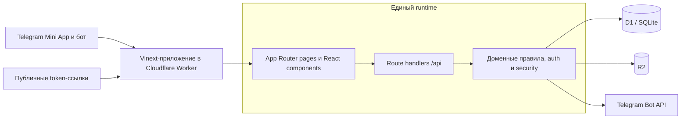

# Asar

Asar — единое full-stack приложение для координации локального общего дела: от круга участников и списка потребностей до подтверждённой готовности, контрольной переклички и зафиксированного результата.

Продукт работает как Telegram Mini App, но приглашения, управление участием и перекличка доступны по защищённым публичным ссылкам. Отдельного backend-сервиса или параллельного интерфейса нет: UI, API, доменные правила и интеграции собираются в один Cloudflare Worker.

## Что решает продукт

Главный пользователь Asar — инициатор локальной помощи. В обычном чате ему трудно понять:

- какие люди и ресурсы действительно нужны;
- какие роли критичны для проведения дела;
- кто просто откликнулся, а кто подтвердил участие;
- осталось ли старое подтверждение актуальным перед началом;
- где нужен быстрый поиск замены.

Asar не гарантирует явку и не оценивает людей. Он превращает разрозненные обещания в явные обязательства и заранее показывает риск срыва.

## Основной сценарий

1. Инициатор открывает Asar через Telegram и создаёт постоянный круг.
2. Внутри круга создаёт асар, указывает дату, место и согласие получателя помощи.
3. Добавляет потребности в людях, навыках, транспорте или материалах и отмечает критические роли.
4. Публикует асар и отправляет общее приглашение либо приглашение на конкретную роль.
5. Участник занимает свободный вклад. Авторизованный Telegram-пользователь подтверждается сразу; внешний гость получает личную ссылку управления.
6. Система пересчитывает готовность по занятым и подтверждённым количествам.
7. За 48 часов до начала инициатор может вручную запустить контрольную перекличку.
8. Участники отдельно подтверждают или отменяют каждую свою роль; отказ сразу освобождает количество.
9. В день асара инициатор отмечает прибытие или неявку, а затем фиксирует полный либо частичный результат.
10. Завершённый асар остаётся в истории, а участник может добровольно указать, с чем к нему допустимо обращаться в будущем.

Отклик на асар не добавляет человека в постоянный круг автоматически. Членство в круге и обязательство в конкретном асаре остаются разными сущностями.

## Готовность

У асара есть три состояния операционной готовности:

| Состояние | Условие |
| --- | --- |
| `NOT_READY` | Хотя бы одна критическая потребность ещё не занята полностью. |
| `PROVISIONAL` | Все критические места заняты, но хотя бы одно подтверждение отсутствует или устарело. |
| `READY` | Все критические количества заняты и имеют актуальное подтверждение. |

`claimedQuantity` показывает занятое количество, а `confirmedQuantity` — количество с действующим подтверждением. Некритические роли влияют на общий процент готовности, но сами по себе не понижают `READY`. В расчёте процента критическая потребность имеет вес 3, некритическая — вес 1.

Жизненный цикл асара (`DRAFT`, `PUBLISHED`, `IN_PROGRESS`, `COMPLETED`, `CANCELLED`, вычисляемый `EXPIRED`), готовность и свежесть переклички — независимые оси состояния.

## Контрольная перекличка

Перекличка является частью существующего асара, а не отдельным продуктом.

- Инициатор запускает её вручную только для опубликованного асара, внутри 48-часового окна и до начала.
- На одну конфигурацию даты и времени разрешён один раунд.
- Один человек получает один запрос, даже если взял несколько ролей.
- По каждой роли хранится отдельное состояние: `PENDING`, `CONFIRMED` или `CANCELLED`.
- `PENDING` сохраняет место занятым, но исключает роль из подтверждённого количества.
- Новое обязательство, подтверждённое после запуска раунда, сразу считается свежим.
- Отказ атомарно отменяет commitment и освобождает роль; отменённую роль нельзя вернуть той же ссылкой.
- Telegram-сообщение отправляется только при явном `reminder_opt_in`, который по умолчанию выключен.
- Для остальных инициатор создаёт ротируемую персональную ссылку и отправляет её вручную.
- Ожидающему Telegram-участнику можно отправить одно повторное напоминание не раньше чем через 6 часов.
- Изменение даты или режима времени закрывает текущий раунд и разрешает новый.
- Старт, завершение и отмена асара закрывают активную перекличку.
- Неответивший участник никогда не отменяется автоматически; cron-задач и автоматического запуска нет.

Для точного времени ссылка действует до начала. Для приблизительного режима — до конца выбранного периода.

## Технологический стек

| Слой | Реализация |
| --- | --- |
| UI | React 19, TypeScript 5.9, Next.js 16 App Router |
| Сборка | Vinext, Vite 8, PostCSS |
| Стили | Tailwind CSS 4 и собственная адаптивная CSS-система |
| Runtime | Cloudflare Worker через Cloudflare Vite plugin |
| Данные | Cloudflare D1 (SQLite), Drizzle ORM и Drizzle Kit |
| Файлы | Cloudflare R2 для фотографий кругов |
| Telegram | `telegram-web-app.js`, собственный WebApp bridge, Bot API и webhook |
| Хостинг | OpenAI Sites с bindings из `.openai/hosting.json` |
| Проверка | Node.js test runner, ESLint и production build |

## Архитектура

Asar — модульный монолит: один репозиторий, один deployment и одна доменная модель.



### Слои проекта

| Путь | Ответственность |
| --- | --- |
| `app/` | App Router страницы и HTTP API. |
| `components/` | Интерфейсы инициатора, участника, круга, приглашения и переклички. |
| `lib/` | Доменные правила, расчёт готовности, расписание, безопасность, Telegram и серверная оркестрация. |
| `db/schema.ts` | Каноническая Drizzle-схема данных. |
| `drizzle/` | Сгенерированные SQL-миграции и их metadata. |
| `worker/` | Cloudflare Worker entry point и обработка изображений. |
| `build/` | Интеграция сборки с OpenAI Sites. |
| `tests/` | Unit-тесты доменных правил и безопасности. |
| `.openai/hosting.json` | Логические bindings D1 `DB` и R2 `GROUP_IMAGES`. |

### Модель данных

| Область | Таблицы |
| --- | --- |
| Круги | `groups`, `group_members` |
| Асары и набор | `asars`, `requirements`, `invites`, `commitments` |
| Перекличка | `reconfirmation_rounds`, `reconfirmation_requests`, `reconfirmation_items` |
| Профили и история | `member_offers`, `profile_offers`, `asar_offer_snapshots`, `group_member_invitations` |
| Разрешения | `user_preferences` |

Уникальные индексы гарантируют один commitment на контакт и потребность, один активный раунд на асар, один запрос на человека в раунде и один элемент на commitment в раунде.

## Безопасность и приватность

- Organizer API принимает подписанный Telegram `initData` либо защищённую серверную Telegram-сессию.
- Подпись `initData`, launch-токенов и сессий проверяется через HMAC-SHA-256; устаревшие данные отклоняются.
- Webhook принимает запросы только с корректным `TELEGRAM_WEBHOOK_SECRET`.
- Публичные invite, manage и reconfirmation ссылки используют случайные bearer-токены; в D1 хранится только SHA-256 hash.
- Перевыпуск ручной ссылки отзывает предыдущий токен.
- Для Telegram-переклички дополнительно проверяется совпадение `participant_key`.
- Занятие количества, запуск раунда и отмена роли защищены условными SQL-операциями, уникальными ограничениями и D1 batch.
- Публичная карточка не получает контакты и данные доставки.
- Точный адрес доступен только участнику с действующим подтверждённым обязательством; во время ожидания переклички исходное обязательство остаётся действующим.
- Telegram-рассылка выполняется только после явного согласия участника.
- Приложение не должно писать в логи сырые токены, контакты и точный адрес.

Продукт не предназначен для хранения диагнозов, документов, финансовых данных или семейной истории получателя помощи.

## Локальный запуск

### Требования

- Node.js `>= 22.13.0`;
- npm;
- Git.

Cloudflare-аккаунт и удалённые D1/R2 для локальной разработки не нужны.

### Установка и старт

```bash
git clone https://github.com/orynbajgalym4-source/Volunteering_is_for_those_who_need_help_-B3.git asar
cd asar
npm ci
npm run dev
```

Откройте URL, который напечатает Vinext; обычно это `http://localhost:3000`.

На `localhost` и `127.0.0.1` organizer API при отсутствии валидной Telegram-сессии автоматически использует демо-профиль `telegram:demo` (`Аружан`). Поэтому интерфейс инициатора можно разрабатывать без Telegram-секретов.

### Локальные D1 и R2

Cloudflare Vite plugin читает `.openai/hosting.json` и автоматически поднимает локальные bindings:

- `DB` — Miniflare D1/SQLite;
- `GROUP_IMAGES` — Miniflare R2.

Локальные данные сохраняются в `.wrangler/state/` и переживают перезапуск dev-сервера. При первом обращении к data route функция `ensureDatabase()` создаёт отсутствующие таблицы и индексы и выполняет совместимые runtime-изменения схемы. Отдельная команда миграции для первого локального запуска не требуется.

### Telegram-интеграция

Для обычного локального демо переменные Telegram необязательны. Для проверки настоящего бота создайте игнорируемый Git файл `.env.local`:

```env
TELEGRAM_BOT_TOKEN=
TELEGRAM_BOT_USERNAME=
TELEGRAM_WEBHOOK_SECRET=
```

- `TELEGRAM_BOT_TOKEN` используется для Bot API, проверки `initData` и подписи серверных сессий.
- `TELEGRAM_BOT_USERNAME` должен содержать username реального бота без обязательного `@`.
- `TELEGRAM_WEBHOOK_SECRET` должен совпадать с secret token, переданным Telegram при настройке webhook.

Не добавляйте реальные секреты в Git. Для webhook и Mini App настоящего бота потребуется доступный по HTTPS deployment.

## Команды разработки

| Команда | Назначение |
| --- | --- |
| `npm run dev` | Запустить локальный Vinext + Cloudflare runtime с D1/R2. |
| `npm run build` | Собрать production-артефакт для Sites. |
| `npm test` | Выполнить production build и затем все `tests/*.test.mjs`. |
| `npm run lint` | Проверить исходники ESLint. |
| `npm run db:generate` | Сгенерировать SQL после изменения `db/schema.ts`. |

`npm run start` не является локальной заменой `npm run dev`: собранному приложению нужны Cloudflare bindings, которые предоставляет Worker/Sites runtime.

Минимальная проверка перед PR:

```bash
npm run lint
npm test
```

## Схема и миграции

При изменении модели данных:

1. Обновите `db/schema.ts`.
2. Выполните `npm run db:generate`.
3. Проверьте новый SQL и metadata в `drizzle/`.
4. Убедитесь, что runtime-инициализация в `ensureDatabase()` остаётся совместимой с существующей D1.
5. Запустите lint и тесты.

`npm run db:generate` только создаёт SQL-файл — команда не применяет миграцию к базе. Sites build упаковывает `.openai/hosting.json` и каталог `drizzle/` в deployment-артефакт.

## Границы API

- Organizer API: `/api/groups`, `/api/asars`, `/api/profile` и вложенные действия владельца.
- Публичный token-based API: `/api/public/invites`, `/api/public/commitments`, `/api/public/reconfirmations`.
- Telegram API: `/api/telegram/session`, `/api/telegram/config`, `/api/telegram/notifications`, `/api/telegram/webhook`.
- Проверка runtime: `/api/health`.

Organizer API не должен возвращать данные другого владельца. Публичные endpoints получают только минимальную модель, необходимую конкретному участнику.

## Ограничения MVP

В текущую версию намеренно не входят:

- внутренний чат;
- донаты и платежи;
- рейтинг надёжности;
- резервные участники;
- глобальная лента и карта волонтёров;
- автоматический запуск переклички и cron-напоминания;
- умные рекомендации;
- обязательное вступление гостя в круг.

Главный принцип MVP: инициатор управляет общим делом, участник явно управляет собственным обязательством, а система делает готовность и риск срыва видимыми.
